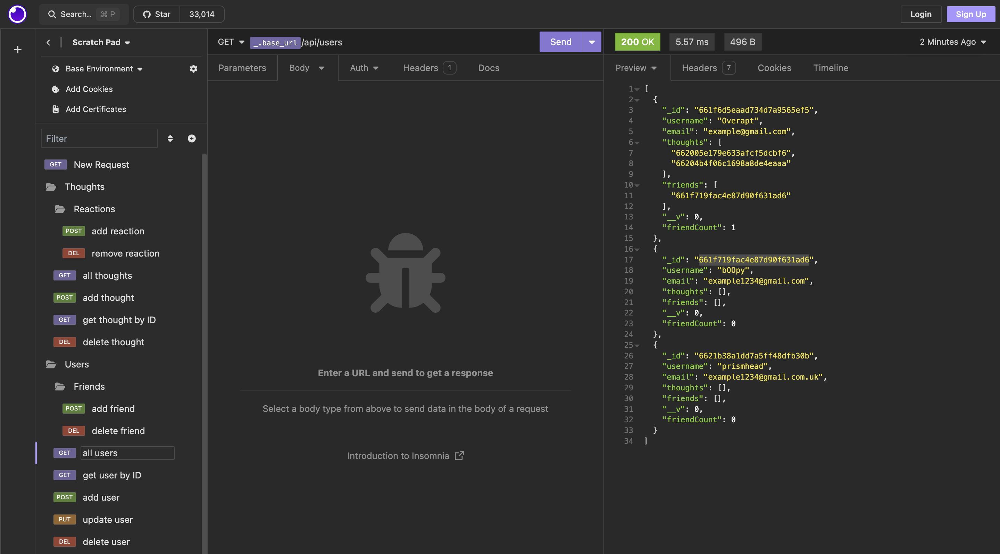
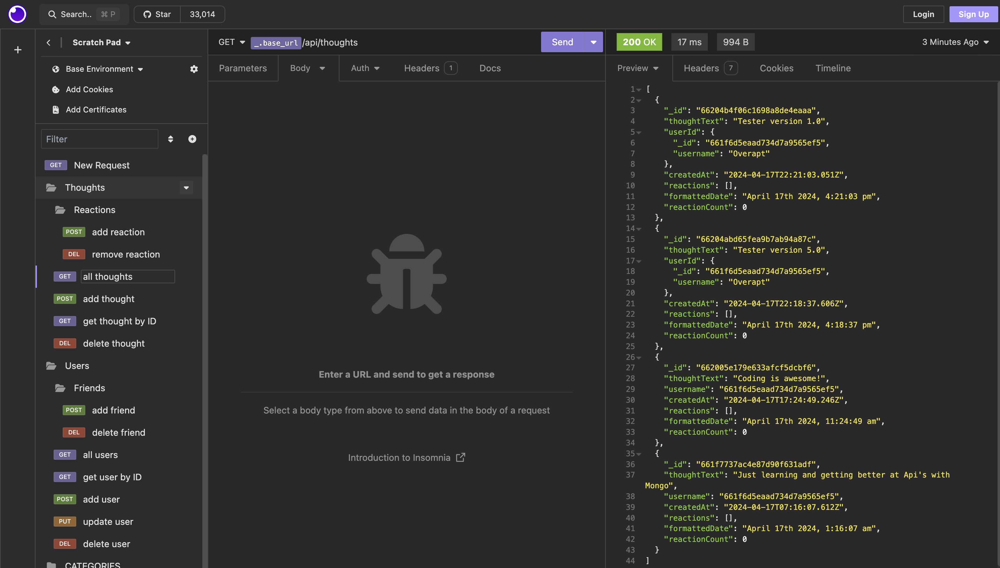

# Mongo Blogger Application

## Description:
The main goal of this project is to build an API for a social network web application where users can share their thoughts, react to friends’ thoughts, and create a friend list. After completion of the project, I have a better understanding on building the back-end side of an application with mongodb and mongoose. I also learned how to connect and reference collections between each other as well as populate through user input. And lastly I learned some better ways to access data through different methods with the mongoose interface.

## Table of Contents:
- [Installation Instructions](#Installation-Instructions)
- [Usage Instructions](#Usage-Instructions)
- [Links](#Links)
- [Features](#Features)
- [Built With](#Built-With)
- [Test Instructions](#Test-Instructions)
- [License](#License)
- [Questions](#Questions)

## Installation Instructions:
Step 1: Clone repository.
 
Step 2: Install Nodejs.
 
Step 3: Install a source-code editor like VsCode.
 
Step 4: Nodemon is recommended in order to run and refresh depending on changes.
 
Step 5: Insomnia is recommended as well in order to access, view, and modify the database.

## Usage Instructions:
Step 1: Open VsCode(preferred) or another source-code editor if not already running.
 
Step 2: Open integrated terminal once in the main folder.
 
Step 3: "run npm i" / "sudo npm i" in the terminal to install the required dependencies.
 
Step 4: Now to run the application, Enter "nodemon server.js" or "npm start" and "node server.js" if you don't have npm nodemon.
 
Step 5: After the "Mongo Blogger Listening on port..." appears in the console, the application is now running. Feel free to access, modify and view the database with Insomnia or a similar application.

## Links
Screenshots:

Youtube video link:
[Youtube Link](https://www.youtube.com/watch?v=D9Ko7PHTrLQ)

## Features:
Javascript variables, destructuring, classes and constructors, promises, try/catch methods, async/await methods, event delegation, models, database schemas and models, etc.

## Built With:
- Dynamic JavaScript
- MVC (Model View Controller) style without views
- Express
- mongoDB
- Mongoose
- License Badge: [Shields.io](https://shields.io/)
- Visual Studio Code: [Website](https://code.visualstudio.com/)

## Test Instructions:
For testing and debugging, the application logs requests and errors in the console. Insomnia is an open source application that takes the pain out of interacting with and designing, debugging, and testing APIs. And is also recommended to view the database and help see it "visually."

## License:
Licensed under the The MIT License license.

  (https://opensource.org/licenses/MIT)

## Questions:
For additional questions or concerns, feel free to contact me via [prismhead26@gmail.com](http://prismhead26@gmail.com). 
You can also find me on Github at [prismhead26](https://github.com/prismhead26).

© 2024 Aiden Wahed. Confidential and Proprietary. All Rights Reserved.